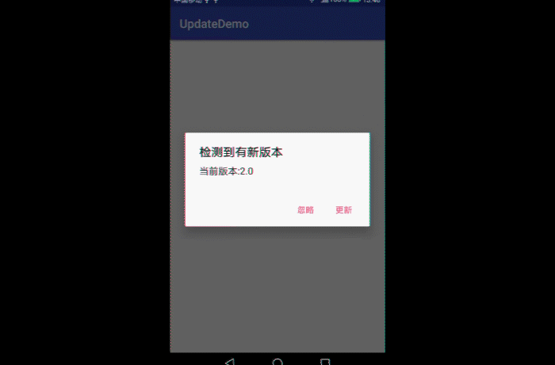
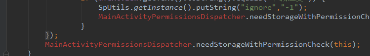

# UpdateDemo
App更新模块源码

## 本Demo要实现的功能
* 忽略本次更新，不再提示
* 有下次版本更新，覆盖之前的忽略，重新弹窗
* 重写虚拟后退键不能关闭dialog
* 下载进度回显
* 下载完成自动安装

### 截图

## 前言
在模仿项目[DanteAndroid/Beauty: Just watch girls. ](https://github.com/DanteAndroid/Beauty)
时候,我发现其中的获取图片模块以及更新模块很很不错,但知识缺乏限制了我丰富的想象力,
导致我研究了半天都没有思路,最后看到了鸿洋公众号(公众号id:hongyangAndroid),顿时
牛肉满面,真的是及时雨,哈哈哈

原作者博客:[Android 实战*版本更新(okhttp3、service、notification) * 简书 ](https://www.jianshu.com/p/b669940c9f3e)
或者[实战版本更新(okhttp3、service、notification) ](http://mp.weixin.qq.com/s/nB5AnvltKfaF0yJNErOUFg)

### 项目用到的知识
* MVP架构
  * 本人目前看到最好的MVP入门教程:[Android mvp 架构的自述 * CSDN博客](http://blog.csdn.net/dantestones/article/details/50899235)
  * [如何更高效的使用MVP以及官方MVP架构解析 * CSDN博客](http://blog.csdn.net/dantestones/article/details/51445208)
  * [Android App的设计架构：MVC,MVP,MVVM与架构经验谈 * 伍歌歌 * 博客园](https://www.cnblogs.com/wytiger/p/5305087.html)
  * 如果你像我这样到现在还没有学习MVP模式，或者还没有熟练的使用MVP模式,这个插件
    MVPPlugin可以帮助你:[Android MVP Plugin，一键完成MVP结构代码编写](https://mp.weixin.qq.com/s/fo34hyvjzNSURSh_V8y4oQ)
  * MVP框架引发的内存泄漏,关于内存泄漏的认识:[深入剖析Android内存泄露原理](http://blog.csdn.net/simplebam/article/details/65079602)
* Service
  * [关于Android Service的全面解析](http://mp.weixin.qq.com/s/LItTE7Gu80FYMPp0VKlZQw)
* Notification通知
   * [全面解析Notification - CSDN博客 ](http://blog.csdn.net/u012124438/article/details/53574649)
   * 这里有一个问题的,就是Builder里面方法setProgress(int max, int progress,
      boolean indeterminate)的第三个参数indeterminate问题,这里有讲解,好好细
      看:[Android官方开发文档Training系列课程：通知用户之在通知中显示进度](http://www.bubuko.com/infodetail-1630910.html)
   * [PendingIntent.getActivity的使用 - 博客园](https://www.cnblogs.com/lyxin/p/5995681.html)
   * "给大家躺个坑，实用Android.support.v4.app.NotificationCompat.BigTextStyle
     的时候，当你的文本内容有感叹号的时候你的通知不会显示出来，还没有具体看源码是
     什么原因......我用的魅族PRO5，大家遇到了就将文本中的感叹号替换掉就可以了",
     在网址[Notification常见样式总结 - 简书](https://www.jianshu.com/p/6c89c3792b90)
     评论区看到

### 用到的框架
* 联网框架:OkHttp
  * [Android网络编程（六）OkHttp3用法全解析 | 刘望舒的博客](http://liuwangshu.cn/application/network/6-okhttp3.html)
  * [OkHttp使用进阶 译自OkHttp Github官方教程 - GavinCT - 博客园](http://www.cnblogs.com/ct2011/p/3997368.html)
  * [OkHttp3之Cookies管理及持久化 - Akioss Share - SegmentFault](https://segmentfault.com/a/1190000004345545)
  * [OkHttp踩坑记：为何 response.body().string() 只能调用一次？](http://mp.weixin.qq.com/s/5dYV_urnRzucR84K2Z08tA)
  * [Android okHttp网络请求之Get/Post请求 - 总李写代码 - 博客园](http://www.cnblogs.com/whoislcj/p/5526431.html)
  * 目前市面上流行的Xutils3,OkGo,鸿洋大神封装的OKHttpUtils以及OkHttpFinal,这
    里我主要参考stay4it的文章:[OkHttp, Retrofit, Volley应该选择哪一个？](https://www.jianshu.com/p/77d418e7b5d6)
  * OkHttp3无法再通过OkHttpClient.cancel(tag)形式来取消请求,为此我身边挺多小伙伴还是使用OkHttp2.x,我个人认为技术始终需要更新,并非因为一个     简单的理由就让你停滞,在这里我参考了以下的文章进行OkHttp封装取消:
    * [关于取消OkHttp请求的问题 - 简书](https://www.jianshu.com/p/b74466039b84)
      上面这篇文章评论这句话说的特别有道理:其实cancel网络请求的时候，如果还未和
      服务器建立连接，它会回调到onFailure()方法中，但是还有一种情况就是它会在
      onResponse的时候刚好cancel网络请求，那么它会在onResponse()方法中抛出
      java.net.SocketException: Socket closed

* PermissionsDispatcher-权限申请
  * [使用 PermissionsDispatcher 轻松解决 Android 权限问题](https://juejin.im/entry/582eaaa02f301e005956aaee)

## 开发中遇到的问题
* 没有找到"MainActivityPermissionsDispatcher" 这Java文件,这里其实是原项目没有做完集成框架permissionsdispatcher造成的        
  <a href="./art/problem1.png"> 
  解决办法:在Project/build.gradle里面的buildscript/dependencies加上
  "classpath 'com.neenbedankt.gradle.plugins:android-apt:1.8'"
* Error:Execution failed for task ':app:kaptDebugKotlin'.
  > Internal compiler error. See log for more details
  新建时候一直爆这个错误,但又查不出什么原因,只好修改一下原作者的项目路径上传啦

## 项目推荐
* [DanteAndroid/Beauty: Just watch girls. ](https://github.com/DanteAndroid/Beauty)
* [推荐3个优质学习项目](https://mp.weixin.qq.com/s/nTo7rqt0Y839r6O28uQW8Q)
* [开源一款超级好用的mp3剪切器app - 掘金 ](https://juejin.im/post/5a324f3f5188253da72e7956)

## 推荐阅读-推荐的可不仅仅是技术
* [面向对象圣经](https://mp.weixin.qq.com/s/dnm24KH6CfqH2QooGw58wg)
* [编程的自学方法](https://mp.weixin.qq.com/s/dsBoZHfsb97owCKiQVIF6g)
* [普通人如何让婚姻更幸福！](https://mp.weixin.qq.com/s/rJ0ETe*mVMTR3nsnMa9E*A)
* [如何更聪明的提问问题？](https://mp.weixin.qq.com/s/weEGm0EY1HO0xzcny2f4yQ)
  * 这个值得一看:[《提问的智慧》中文版 ](https://github.com/tvvocold/How*To*Ask*Questions*The*Smart*Way)
* [为什么有人不回你信息，却在发朋友圈？](https://mp.weixin.qq.com/s/*cSpKI2RSX8gTn5p4Ely*w)

## Support
最近在项目中学习,在项目中成长,所以亲们会看到我在项目里面写博客啦,哈哈哈  
如果你喜欢这个repository，请我喝杯咖啡，我会让它更完美~  

